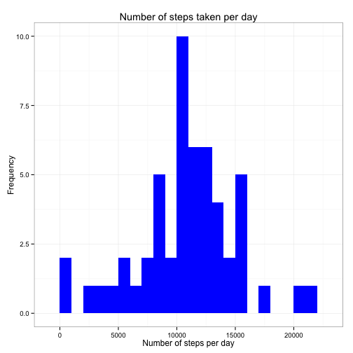
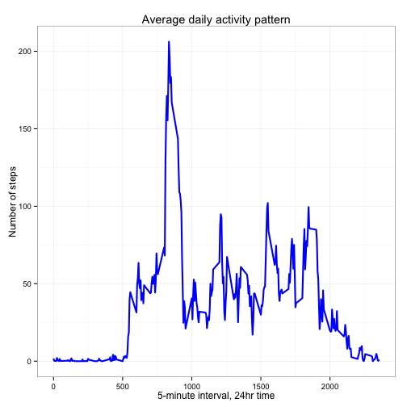
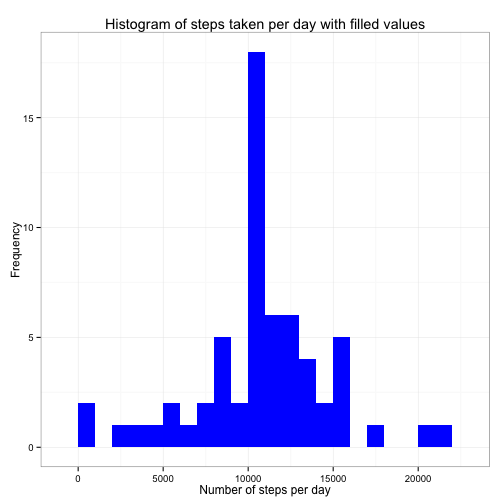
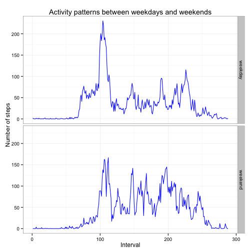

##Introduction

It is now possible to collect a large amount of data about personal movement using activity monitoring devices such as a Fitbit, Nike Fuelband, or Jawbone Up. These type of devices are part of the “quantified self” movement – a group of enthusiasts who take measurements about themselves regularly to improve their health, to find patterns in their behavior, or because they are tech geeks. But these data remain under-utilized both because the raw data are hard to obtain and there is a lack of statistical methods and software for processing and interpreting the data.

This assignment makes use of data from a personal activity monitoring device. This device collects data at 5 minute intervals through out the day. The data consists of two months of data from an anonymous individual collected during the months of October and November, 2012 and include the number of steps taken in 5 minute intervals each day.

###Data

The data for this assignment can be downloaded from the course web site:

Dataset: Activity monitoring data [52K] https://d396qusza40orc.cloudfront.net/repdata%2Fdata%2Factivity.zip
The variables included in this dataset are:

steps: Number of steps taking in a 5-minute interval (missing values are coded as NA)

date: The date on which the measurement was taken in YYYY-MM-DD format

interval: Identifier for the 5-minute interval in which measurement was taken

The dataset is stored in a comma-separated-value (CSV) file and there are a total of 17,568 observations in this dataset.

###Load the required data
This uses read.csv to read the data. Here, we assume that activity.csv is in the current working dirctory.

```r
library("knitr")
repData <- read.csv("activity.csv", header=T, sep=",", colClasses=c("numeric", "character", "numeric"))

#convert to Date
repData$date <- as.Date(repData$date, format="%Y-%m-%d")
```

Here is our data structure:

```r
str(repData)
```

```
## 'data.frame':	17568 obs. of  3 variables:
##  $ steps   : num  NA NA NA NA NA NA NA NA NA NA ...
##  $ date    : Date, format: "2012-10-01" "2012-10-01" ...
##  $ interval: num  0 5 10 15 20 25 30 35 40 45 ...
```

###What is the mean total number of steps taken per day?

The total number of steps is calculated per day.


```r
stepsPerDay <- aggregate(steps ~ date, repData, sum)
colnames(stepsPerDay) <- c("date","steps")
head(stepsPerDay)
```

```
##         date steps
## 1 2012-10-02   126
## 2 2012-10-03 11352
## 3 2012-10-04 12116
## 4 2012-10-05 13294
## 5 2012-10-06 15420
## 6 2012-10-07 11015
```

Make a histogram of the total number of steps taken each day

```r
library(ggplot2)
ggplot(stepsPerDay, aes(x=steps)) + geom_histogram(fill="blue",binwidth=1000) +
        labs(title="Number of steps taken per day", x = "Number of steps per day", y="Frequency") +
        theme_bw()
```

 

Calculate and report the mean and median of the total number of steps taken per day

```r
#Calculate mean
mean(stepsPerDay$steps)
```

```
## [1] 10766.19
```

```r
#Calculate median
median(stepsPerDay$steps)
```

```
## [1] 10765
```

### What is the average daily activity pattern?

Make a time series plot (i.e. type = "l") of the 5-minute interval (x-axis) and the average number of steps taken, averaged across all days (y-axis).


```r
#Convert interval to Factor class
repData$interval <- as.factor(repData$interval)
stepsPerInt <- aggregate(repData$steps, by = list(interval = repData$interval),
                         FUN=mean, na.rm=TRUE)

##Plot data

#Convert to integers
stepsPerInt$interval <- as.integer(levels(stepsPerInt$interval)[stepsPerInt$interval])
colnames(stepsPerInt) <- c("interval", "steps")

ggplot(stepsPerInt, aes(x=interval, y=steps)) + geom_line(color="blue", size=1) +
        labs(title="Average daily activity pattern", x="5-minute interval, 24hr time", y="Number of steps") +
        theme_bw()
```

 
Find 5-minute interval, on average across all the days in the dataset, contains the maximum number of steps:


```r
stepsPerInt[which.max(stepsPerInt$steps),]
```

```
##     interval    steps
## 104      835 206.1698
```

Average daily activity is highest around 8:35 am.

###Imputing missing values
Note that there are a number of days/intervals where there are missing values (coded as NA). The presence of missing days may introduce bias into some calculations or summaries of the data.

Here, calculate and report the total number of missing values in the dataset (i.e. the total number of rows with NAs):


```r
#Number of missing lines
numMissing <- sum(is.na(repData$steps))
```

Devise a strategy for filling in all of the missing values in the dataset. The strategy does not need to be sophisticated, using the mean for that 5-minute interval.


```r
#fillNA finds the NA values and replaces them with the interval mean
fillNA <- function(data, perInterval){
        indexNA <- which(is.na(repData$steps))
        replaceNA <- unlist(lapply(indexNA, FUN=function(idx){
                interval=data[idx,]$interval
                perInterval[perInterval$interval == interval,]$steps
        }))
        stepsToFill <- data$steps
        stepsToFill[indexNA] <- replaceNA
        stepsToFill
}

repDataFill <- data.frame(steps = fillNA(repData, stepsPerInt), 
                          date = repData$date, 
                          interval = repData$interval)
str(repDataFill)
```

```
## 'data.frame':	17568 obs. of  3 variables:
##  $ steps   : num  1.717 0.3396 0.1321 0.1509 0.0755 ...
##  $ date    : Date, format: "2012-10-01" "2012-10-01" ...
##  $ interval: Factor w/ 288 levels "0","5","10","15",..: 1 2 3 4 5 6 7 8 9 10 ...
```

```r
sum(is.na(repDataFill$steps))
```

```
## [1] 0
```
Output shows no missing values.

Create a histogram of the total number of steps taken each day and calculate and report the mean and median total number of steps taken per day:

```r
filledSteps <- aggregate(steps ~ date, repDataFill, sum)
colnames(filledSteps) <- c("date", "steps")

#plot histogram
ggplot(filledSteps, aes(x=steps)) + geom_histogram(fill="blue",binwidth=1000) + 
               labs(title="Histogram of steps taken per day with filled values",
                    x= "Number of steps per day", y="Frequency") + theme_bw()
```

 

```r
#calculate mean
mean(filledSteps$steps)
```

```
## [1] 10766.19
```

```r
#calculate median
median(filledSteps$steps)
```

```
## [1] 10766.19
```

Do these values differ from the estimates from the first part of the assignment? What is the impact of imputing missing data on the estimates of the total daily number of steps?

The values differ slightly, but the mean is equal and the median is very close. The mean and median are equal for filled data. The histogram has higher values as expected, but the general trend is not greatly affected.

Before filling the data:<br/>
Mean : 10766.19<br/>
Median: 10765

After imputing the data:<br/>
Mean : 10766.19<br/>
Median: 10766.19

###Are there differences in activity patterns between weekdays and weekends?

Create a new factor variable in the dataset with two levels -- "weekday" and "weekend" indicating whether a given date is a weekday or weekend day.


```r
#load dplyr library to manipulate data
library(dplyr)

repDataFill <- mutate(repDataFill,
                      weekdays = ifelse(weekdays(date) == "Saturday" |
                                      weekdays(date) == "Sunday",
                                      "weekend", 
                                      "weekday"))
repDataFill$weekdays <- as.factor(repDataFill$weekdays)
str(repDataFill)
```

```
## 'data.frame':	17568 obs. of  4 variables:
##  $ steps   : num  1.717 0.3396 0.1321 0.1509 0.0755 ...
##  $ date    : Date, format: "2012-10-01" "2012-10-01" ...
##  $ interval: Factor w/ 288 levels "0","5","10","15",..: 1 2 3 4 5 6 7 8 9 10 ...
##  $ weekdays: Factor w/ 2 levels "weekday","weekend": 1 1 1 1 1 1 1 1 1 1 ...
```

Make a panel plot containing a time series plot (i.e. type = "l") of the 5-minute interval (x-axis) and the average number of steps taken, averaged across all weekday days or weekend days (y-axis). 


```r
repDataFill$interval <- as.numeric(repDataFill$interval)
dayIntervalSteps <- group_by(repDataFill, interval, weekdays)
summDaySteps <- summarise(dayIntervalSteps, averageSteps=mean(steps))
head(summDaySteps, n=10)
```

```
## Source: local data frame [10 x 3]
## Groups: interval
## 
##    interval weekdays averageSteps
## 1         1  weekday  2.251153040
## 2         1  weekend  0.214622642
## 3         2  weekday  0.445283019
## 4         2  weekend  0.042452830
## 5         3  weekday  0.173165618
## 6         3  weekend  0.016509434
## 7         4  weekday  0.197903564
## 8         4  weekend  0.018867925
## 9         5  weekday  0.098951782
## 10        5  weekend  0.009433962
```

Make a panel plot containing a time series plot (i.e. type = "l") of the 5-minute interval (x-axis) and the average number of steps taken, averaged across all weekday days or weekend days (y-axis). 


```r
ggplot(data=summDaySteps, aes(x=interval, y=averageSteps)) +
        geom_line(color="blue") +
        facet_grid(weekdays ~ .) +
        labs(title="Activity patterns between weekdays and weekends",x="Interval", y= "Number of steps") +
        theme_bw() 
```

 

The data shows that people have a spike in activity in the morning on weekdays, where there is no obvious spike on weekends.
